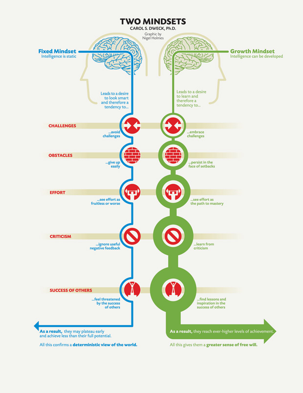

# Fixed vs Growth Mindset

Source: [Mindset by Carol Dweck](https://www.samuelthomasdavies.com/book-summaries/psychology/mindset/)

## The Book in Three Sentences

1. Skills can be cultivated through effort.
2. People with a growth mindset thrive on challenges.
3. The fixed mindset: “I can’t do it”. The growth mindset: “I can’t do it yet”.

## The Five Big Ideas

1. The view you adopt for yourself profoundly affects the way you lead your life.
2. “Believing that your qualities are carved in stone—the fixed mindset—creates an urgency to prove yourself over and over”.
3. “People in a growth mindset don’t just seek challenge, they thrive on it”.
4. “The growth mindset does allow people to love what they’re doing—and to continue to love it in the face of difficulties”.
5. “Those with the growth mindset found success in doing their best, in learning and improving. And this is exactly what we find in the champions”.

## Mindset Summary

* “[Children with a growth mindset] knew that human qualities, such as intellectual skills, could be cultivated through effort”.
* “Not only were [the children with a growth mindset]not discouraged by failure, they didn’t even think they were failing. They thought they were learning”.
* “What are the consequences of thinking that your intelligence or personality is something you can develop, as opposed to something that is a fixed, deep-seated trait?”
* “Robert Sternberg, the present-day guru of intelligence, writes that the major factor in whether people achieve expertise ‘is not some fixed prior ability, but purposeful engagement’.”
* “For twenty years, my research has shown that the view you adopt for yourself profoundly affects the way you lead your life”.
* “Believing that your qualities are carved in stone—the fixed mindset—creates an urgency to prove yourself over and over”.
* “This growth mindset is based on the belief that your basic qualities are things you can cultivate through your efforts. Although people may differ in every which way—in their initial talents and aptitudes, interests, or temperaments—everyone can change and grow through application and experience”.
* “Why waste time proving over and over how great you are, when you could be getting better? Why hide deficiencies instead of overcoming them?”
* “The passion for stretching yourself and sticking to it, even (or especially) when it’s not going well, is the hallmark of the growth mindset”.
* “The fixed mindset makes you concerned with how you’ll be judged; the growth mindset makes you concerned with improving”.
* “When you enter a mindset, you enter a new world. In one world—the world of fixed traits—success is about proving you’re smart or talented. Validating yourself. In the other—the world of changing qualities—it’s about stretching yourself to learn something new. Developing yourself”.
* “Benjamin Barber, an eminent sociologist, once said, ‘I don’t divide the world into the weak and the strong, or the successes and the failures…. I divide the world into the learners and non-learners’.”
* “People in a growth mindset don’t just seek challenge, they thrive on it”.
* “We gave fifth graders intriguing puzzles, which they all loved. But when we made them harder, children with the fixed mindset showed a big plunge in enjoyment”.
* “For [people with a growth mindset] it’s not about immediate perfection. It’s about learning something over time: confronting a challenge and making progress”.
* “‘Becoming is better than being’. The fixed mindset does not allow people the luxury of becoming. They have to already be”.
* “People with the growth mindset know that it takes time for potential to flower”.
* “College students, after doing poorly on a test, were given a chance to look at tests of other students. Those in the growth mindset looked at the tests of people who had done far better than they had. As usual, they wanted to correct their deficiency. But students in the fixed mindset chose to look at the tests of people who had done really poorly. That was their way of feeling better about themselves”.
* “John Wooden, the legendary basketball coach, says you aren’t a failure until you start to blame. What he means is that you can still be in the process of learning from your mistakes until you deny them”.
* “French executive Pierre Chevalier says, ‘We are not a nation of effort. After all, if you have savoir-faire [a mixture of know-how and cool], you do things effortlessly’.”
* “People with the growth mindset, however, believe something very different. For them, even geniuses have to work hard for their achievements”.
* “They may appreciate endowment, but they admire effort, for no matter what your ability is, effort is what ignites that ability and turns it into accomplishment”.
* “The growth mindset does allow people to love what they’re doing—and to continue to love it in the face of difficulties”.
* “Those with the growth mindset found success in doing their best, in learning and improving. And this is exactly what we find in the champions”.
* “Those with the growth mindset found setbacks motivating. They’re informative. They’re a wake-up call”.
* “People with the growth mindset in sports (as in pre-med chemistry) took charge of the processes that bring success—and that maintain it”.

## Related

* [Growth Mindset by Carol Dweck (animated book summary) - Growth Mindset and Fixed Mindset](https://www.youtube.com/watch?v=EyIF5VUOJc0)