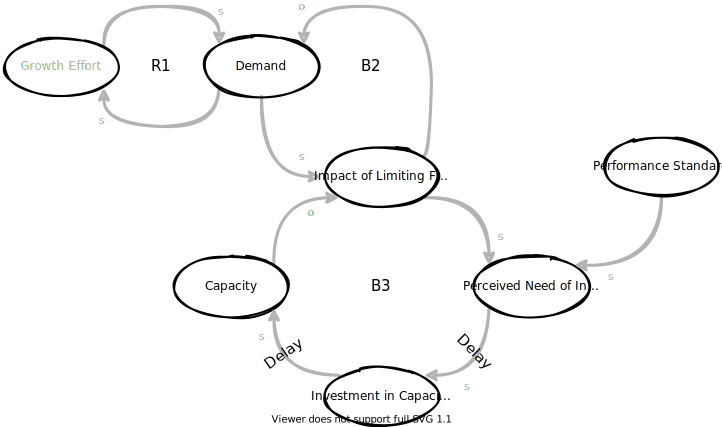

<!-- markdownlint-disable  MD024 MD045-->

# System Archetypes

Source: [SYSTEMS ARCHETYPES AS DYNAMIC THEORIES](https://thesystemsthinker.com/wp-content/uploads/pdfs/240111pk.pdf)

## Drifting Goals

### Archetype

### Dynamic Theory

The “Drifting Goals” archetype states that a gap between a goal and an actual condition can be resolved in two ways: by taking corrective action to achieve the goal, or by lowering the goal. It hypothesizes that when there is a gap between the goal and the actual condition, the goal is lowered to close the gap. Over time, the continual lowering of the goal will lead to gradually deteriorating performance.

### Prescriptive Actions

* Anchor the goal to an external frame of reference to keep it from sliding (e.g., benchmarking, voice of the customer).
* Determine whether the drift in performance is the result of conflicts between the stated goal and implicit goals in the system (such as current
performance measures).
* Establish a clear transition plan from current reality to the goal, including a
realistic timeframe for achieving the goal.

### Application

#### Staying Focused on Vision

Various pressures can often take our attention away from what we are trying to achieve. The “Drifting Goals” archetype helps explain why an organization is not able to achieve its desired goals. Used as a diagnostic tool, it can target drifting performance areas and help organizations attain their visions.

### Intervention Guidelines

1. Identify drifting performance measure.
2. Look for goals that conflict with the stated goal.
3. Identify standard procedures for closing the gap. Are they inadvertently contributing to the goal slippage?
4. Examine the past history of the goal. Have the goals themselves been lowered over time?
5. Anchor the goal to an external reference.
6. Clarify a compelling vision that will involve everyone.
7. Create a clear transition plan. Explore what it will take to achieve the vision, and establish a realistic timeline.

### Example
tbd

### Related

* [Video: Systems Thinking - System Archetypes - Eroding Goals](https://www.youtube.com/watch?v=rZ5G2jEHXmU)

## Escalation

### Archetype

### Dynamic Theory

The “Escalation” archetype occurs when one party’s actions are perceived by another party to be a threat, and the second party responds in a similar manner, further increasing the threat. It hypothesizes that the two balancing loops will create a reinforcing figure-8 effect,resulting in threatening actions by both parties that grow exponentially over time.

### Prescriptive Actions

* Identify the relative measure that ispitting one party against another, and explore ways it can be changed or other ways the two parties can differentiate themselves in the marketplace.
* Quantify significant delays in the system that may be distorting thenature of the threat.
* Identify a larger goal that encompasses the individual goalsof both parties.

### Application

#### Competition

One of the reasons we get caught in escalation dynamics may stem from our view of competition. The “Escalation” archetype suggests that cutthroat competition serves no one well in the long run. The archetype provides a way to identify escalation structures at work and shows how to break out of them or avoid them altogether.

### Intervention Guidelines

1. Identify the competitive variable. Is a single variable the basis of differentiation between competitors?
2. Name the key players caught in the dynamic.
3. Map what is being threatened. Are your company’s
actions addressing the real threat, or simply preserving core values that may no longer be relevant?
4. Reevaluate competitive measure. Can the variable that is the foundation of the game (price, quality, etc.) be shifted?
5. Quantify significant delays that may be distorting the nature of the threat.
6. Identify a larger goal encompassing both parties’ goals.
7. Avoid future “Escalation” traps by creating a system of collaborative competition.

### Example
tbd

### Related

* [Video: Systems Thinking - System Archetypes - Escalation](https://www.youtube.com/watch?v=u1b8j541EcY)

## Fixes That Fail

### Archetype

### Dynamic Theory

The “Fixes That Fail” archetype states that a “quick-fix” solution can have unintended consequences that exacerbate the problem. It hypothesizes that the problem symptom will diminish for a short while and then return to its previous level, or become even worse over time.

### Prescriptive Actions

* Focus on identifying and removing the fundamental cause of the problem symptom.
* If a temporary, short-term solution is needed, develop a two-tier approach of simultaneously applying the fix and planning out the fundamental solution.
* Use the archetype to map out potential side effects of any proposed interventions.

### Application

#### Problem-Solving

Almost any decision carries long-term and shortterm consequences, and the two are often diametrically opposed. The “Fixes That Fail” archetype can help you get off the problem-solving treadmill by identifying fixes that may be doing more harm than good.

### Intervention Guidelines

1. Identify problem symptom.
2. Map current interventions and how they were expected to rectify the problem.
3. Map unintended consequences of the interventions.
4. Identify fundamental causes of the problem.
5. Find connections between both sets of loops. Are the fixes and the fundamental causes linked?
6. Identify high-leverage interventions. Add or break links in the diagram to create structural interventions.
7. Map potential side-effects for each intervention in order to be prepared for them (or to avoid them altogether).

### Example
tbd

## Growth and Underinvestment

### Archetype

### Dynamic Theory

The “Growth and Underinvestment” archetype applies when growth approaches a limit that can be overcome if capacity investments are made. If a system becomes stretched beyond its limit, however, it will compensate by lowering performance standards, which reduces the perceived need for capacity investments. It also leads to lower performance, which further justifies underinvestment over time.

### Prescriptive Actions

* Identify interlocked patterns of behavior between capacity investments and performance measures.
* Shorten the delays between when performance declines and when additional capacity comes on line (particularly perceptual delays about the need to invest).
* Anchor investment decisions on external signals, not on standards derived from past performance.

### Application

#### Capital Planning

If demand outstrips capacity, performance can suffer and hurt demand. If this dynamic is not recognized, the decrease in demand can then be used as a reason not to invest in the needed capacity. “Growth and Underinvestment” can be used to ensure that investment decisions are viewed from a fresh perspective, rather than relying on past decisions.

### Intervention Guidelines

1. Identify interlocked patterns of behavior between capacity investments and performance measures.
2. Identify delays between when performance falls and when additional capacity comes on-line—particularly perceptual delays regarding the need to invest.
3. Quantify and minimize acquisition delays.
4. Identify related capacity shortfalls. Are other parts of the system too sluggish to benefit from added capacity?
5. Fix investment decisions on external signals, not on standards derived from past performance.
6. Avoid self-fulfilling prophecies. Challenge the assumptions that drive capacity investment decisions.
7. Search for diverse investment inputs. Seek new perspectives on products, services, and customer requirements.

### Example
tbd

## Limits to Success

### Archetype

### Dynamic Theory

The “Limits to Success” archetype states that a reinforcing process of accelerating growth (or expansion) will encounter a balancing process as the limit of that system is approached. It hypothesizes that continuing efforts will produce diminishing returns as one approaches the limit.

### Prescriptive Actions

* Focus on removing the limit (or weakening its effects) rather than continuing to drive the reinforcing processes of growth.
* Use the archetype to identify potential balancing processes before they begin to affect growth.
* Identify links between the growth processes and limiting factors to determine ways to manage the balance between the two.

### Application

#### Planning

If we don’t plan for limits, we are planning for failure. The “Limits to Success” archetype shows that being successful can be just as dangerous to long-term health as being unsuccessful. By mapping out the growth engines and potential danger points in advance, we can anticipate future problems and eliminate them before they become a threat.

### Intervention Guidelines

1. Identify the growth engines.
2. Determine doubling time of those processes.
3. Identify potential limits and balancing loop(s)—physical capacity, information systems, personnel, management expertise, attitudes/mental models.
4. Determine change required to deal effectively with the limit(s) identified.
5. Assess time needed to change. Is there a discrepancy between the doubling time and the changes that need to be made to support that growth?
6. Balance the growth. What strategies can be used to balance the growth engine with the time frame of the investments that must be made to sustain it?
7. Reevaluate the growth strategy. Continually challenge assumptions in context of the broader company.

### Example
tbd

## Shifting the Burden/Addiction

### Archetype

### Dynamic Theory

The “Shifting the Burden” archetype states that a problem symptom can be resolved either by using a symptomatic solution or applying a fundamental solution. It hypothesizes that once a symptomatic solution is used, it alleviates the problem symptom and reduces pressure to implement a more fundamental solution. The symptomatic solution also produces a side effect that systematically undermines the ability to develop a fundamental solution or capability.

### Prescriptive Actions

* Focus on the fundamental solution. If necessary, use the symptomatic solution only to gain time while working on the fundamental solution.
* Elicit multiple viewpoints to differentiate between fundamental/ symptomatic solutions and to gain consensus around an action plan.
* Use the archetype to explore potential side effects of any proposed solution.

### Application

### Break Organizational Gridlock

Organizational gridlock can be caused by interlocking “Shifting the Burden” structures, as one function’s “solution” creates problems in another area. The archetype provides a starting point for breaking gridlock by identify ing chains of problem symptoms and solutions that form walls between functions, departments, or divisions.

### Intervention Guidelines

1. Identify the original problem symptoms.
2. Map all “quick fixes” that appear to be keeping the problems under control.
3. Identify impact on others. What are the inpacts of those “solutions” on other players in the company?
4. Identify fundamental solutions. Look at the situation from both perspectives to find a systemic solution.
5. Map side-effects of quick fixes that may be undermining the usability of the fundamental solution.
6. Find interconnections to fundamental loops. Find the links between the interaction effects and the fundamental solution that may be creating gridlock.
7. Identify high-leverage actions from both perspectives.

### Example
tbd

### Related
* [Video: Systems Thinking - System Archetypes - Shifting the Burden](https://www.youtube.com/watch?v=WpRT987rRUQ)

## Successful to the Successful

### Archetype

### Dynamic Theory

The “Success to the Successful” archetype states that if one person or group (A) is given more resources than another equally capable group (B), A has a higher likelihood of succeeding. It hypothesizes that A’s initial success justifies devoting more resources to A, further widening the performance gap between the two groups over time.

### Prescriptive Actions

* Evaluate the current measurement systems to determine if they are set up to favor established practices over other alternatives.
* Identify goals or objectives that will define success at a higher level than individual players “A” and “B.”
* Calibrate internal views of market success against external indicators to identify potential competency traps.

### Application

#### Avoid Competency Traps

The “Success to the Successful” archetype suggests that success or failure may be due more to initial conditions than intrinsic merits. It can help organizations challenge their success loops by “unlearning” what they are already good at in order to explore new approaches and alternatives.

### Intervention Guidelines

1. Investigate historical origins of competencies.
2. Identify potential competency traps.
3. Evaluate current measurement systems—are they set up to favor current systems over other alternatives?
4. Map internal view of market success. What are the operating assumptions around success in the market?
5. Obtain external views of market success. Ask “outsiders” for alternative strategies.
6. Assess effects on the innovative spirit. Is the current system excluding or limiting the spirit of experimentation that will lead to new alternatives?
7. Continually scan for gaps and areas for improvement.

### Example
tbd

## Tradegy of the Commons

### Archetype

### Dynamic Theory

The “Tragedy of the Commons” archetype identifies the causal connections between individual actions and the collective results (in a closed system). It hypothesizes that if the total usage of a common resource becomes too great for the system to support, the commons will become overloaded or depleted and everyone will experience diminishing benefits.

### Prescriptive Actions

* Establish methods for making the cumulative effects of using the common resource more real and immediate to the individual users.
* Re-evaluate the nature of the commons to determine if there are ways to replace or renew (or substitute for) the resource before it becomes depleted.
* Create a final arbiter who manages the use of the common resource from a whole-system level.

### Application

#### Resource Allocation

In a “Tragedy of the Commons” situation, the complex interaction of individual actions produces an undesirable collective result, such as the depletion of a common resource. The archetype can be used to help connect the long-term effects of individual actions to the collective outcome, and to develop measures for managing the common resource more effectively.

### Intervention Guidelines

1. Identify the “commons.” What is the common resource that is being shared?
2. Determine incentives. What are the reinforcing processes that are driving individual use of the resource?
3. Determine time frame for reaping benefits.
4. Determine time frame for experiencing cumulative effects of the collective action.
5. Make the long-term effects more present. How can the long-term loss or degradation of the commons be more real and present to the individual users?
6. Reevaluate the nature of the commons. Are there other resources or alternatives that can be used to remove the constraint upon the commons?
7. Limit access to resources. Determine a central focal point—a shared vision, measurement system, or final arbiter—that allocates the resource based on the needs of the whole system.

### Example
tbd

### Related

* [Video: System Thinking - System Archetypes - Tragedy of the Commons](https://www.youtube.com/watch?v=Pu6vfId92II)
