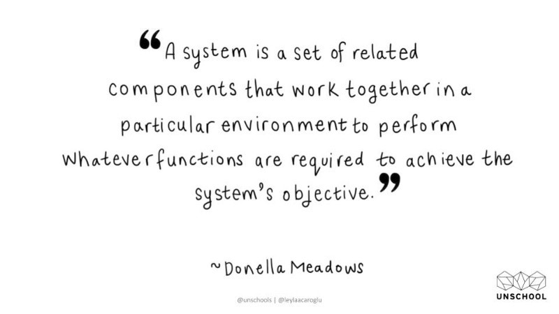
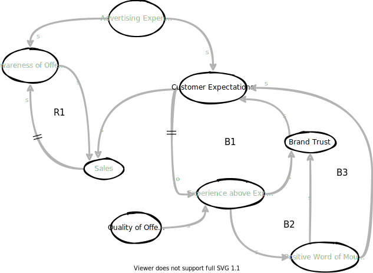
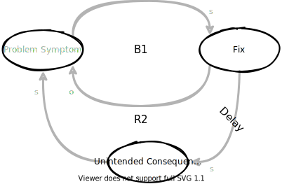
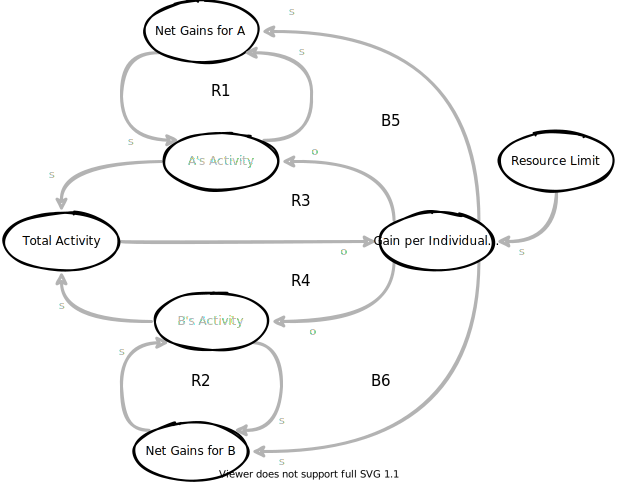
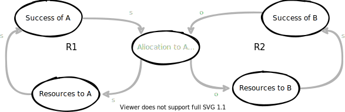

<!-- markdownlint-disable MD025 MD045 MD012 MD024 -->
# Systems Thinking - ganz praktisch

 Egal ob es um die Situation in Deinem **Team**, die **Firma** in der Du arbeitest, Deine **persönliche Weiterentwicklung** oder um große **globale Themen** geht: Sich „ein Bild“ von der Welt zu machen ist nicht einfach. Um komplexe Systeme und deren Wirkzusammenhänge zu verstehen, existieren eine Reihe **mentale Modelle** und zugehörigen Visualisierungstechniken.

Wir werden ausgewählte – z. B. **Current Reality Trees**, **Future Reality Trees**, **Causal Loop Diagrams** und **Archetypes** – kennenlernen und sie auf praktische Alltagssituationen anwenden.

Nach dem Workshop werdet ihr „eure Systeme“ wieder ein bisschen gezielter beeinflussen und verbessern können.

---
<!-- _backgroundColor: lightblue -->
* # 🤹 What makes you complex as a living system?

* # 🧑🏻‍🤝‍🧑🏼 What kind of system is your team, your company?

---
<!-- _backgroundColor: lightblue -->
* # 🕸️ How much do you work with Systems Thinking so far?
* # 👊 What are your motivation and questions for today's workshop?

---

# Info and Agreements

* Agenda
  * 4x80 minutes, with breaks
  * Lunch 12:00 - 13:00
* This is a PowerPoint free session 🤪
* All material in English (Really?)
* Working in thing.online
* Our Miro board
* [Our Github repo](https://github.com/thomykay/devspace-systemsthinking/tree/%23devspace2022)
* We are all experts. We are all learners.
* Let'make this a safe space for all of us!
  
---

# What is a System?

---

# What is Systems Thinking?

* the ability or skill to perform problem solving in complex system
* Systems thinking is your ability to see things as a whole (or holistically) including the many different types of relationships between the many elements in a complex system.

> The same old thinking will create the same old results, thus we need to start by changing our way of thinking and looking at the world.

---

# Systems Thinking - The Domains

Source: [Systems Innovation Guide](https://www.systemsinnovation.io/post/systems-innovation-guide)

---

# Systems Thinking - The Timeline

Source: [Systems Innovation Guide](https://www.systemsinnovation.io/post/systems-innovation-guide)

---

# Tools - 6 Fundamental Concepts of Systems Thinking

See: [Details](https://github.com/thomykay/devspace-systemsthinking/blob/main/src/material/tools-of-a-systems-thinker.md)

---

# The Fifth Disciplin - The Book

Peter Senge, 1990

Idea of "The Learning Organization"

---

# The Five Diciplines

See: [Details](https://github.com/thomykay/devspace-systemsthinking/blob/main/src/material/the-fifth-discipline.md)

---
<!-- backgroundColor: default -->
# Current Reality Tree

...is a tool to **analyze** many systems or organizational problems at once. By **identifying root causes** common to most or all of the problems, a CRT can greatly aid focused improvement of the system. A current reality tree is a **directed graph**.

---

# Current Reality Tree (CRT) - Structure

---

# Undesirable Effects (UDE)

> An UDE is essentially the first indication you have that something might be amiss in the system. It is something that really exists and is negative on its own merits.
>
> William Dettmer, The Logical Thinking Processes, 2007

* Examples
  * Employee morale is low
  * Decreasing profit
  * Attrition is increasing
  * byo…

---
<!-- _backgroundColor: lightblue -->
# UDE Excercise - Team from Hell

Source: [Solving Problems with Theory of Constraints, CRTs @ Lean Agile Edinburgh](https://www.slideshare.net/lazallen/solving-problems-with-theory-of-constraints-current-reality-trees-lean-agile-edinburgh)

|Time &nbsp; &nbsp; &nbsp; &nbsp; &nbsp; &nbsp; &nbsp;|What|
|--|--|
|🕜3min|🧍Individually: Note **7 things that drive you crazy** about team work|
|🕜10min|🧑🏻‍🤝‍🧑🏼 Share the lists with each other. *use bingo*|...|
|🕜5min|🧑🏻‍🤝‍🧑🏼 As a 'new team', what are your top 5? *use circle ordering or dot-voting*|
|🕜...|Optional: Share **horror stories** about each person's experience with Teams From Hell.|

---
<!-- _backgroundColor: lightblue -->
# UDE - Debrief

* 🪢 What reminded you of your day-to-day?
* 💬 What did this teach you about great communication?
* 🎯 How did you align on the goal?

---

# Apropos "Team from Hell" - Team Dysfunctions

---

<!-- backgroundColor: default -->
# Reading a CRT (1)

---

# Reading a CRT (2)

---

# Reading a CRT (3)

---

# Reading a CRT (4)

---
<!-- _backgroundColor: lightblue -->
# CRT Exercise - Team from Hell

Starting with the collected UDEs, build the CRT for the “Team from Hell”.

|Time &nbsp; &nbsp; &nbsp; &nbsp; &nbsp; &nbsp; &nbsp; &nbsp; &nbsp;|What|
|--|--|
|🕜15min|🧑🏻‍🤝‍🧑🏼 Identify intermediate effects and how they are related|
|🕜...| 🧑🏻‍🤝‍🧑🏼 Can you identify any root causes? Which?|
|🕜5min|🧑🏻‍🤝‍🧑🏼 As a group, prepare to read through your CRT|

---
<!-- _backgroundColor: lightblue -->
# CRT - Debrief

* 💬 Doing it again, how would you communicate differently?
* 👌 How did you organize yourselves as a team?
* 🎬 What does this experience remind you of in your day-to-day?

---

# CRT - Reading (Extra)

Source: [Scrutinizing and improving a Logical Current Reality Tree](https://www.youtube.com/watch?v=NVrEt6hDJVM&t=65s)

Unoptimized             |  Optimized
:-------------------------:|:-------------------------:
  |  

---

# Future Reality Tree

is a **visualization of a desired, improved future state**. ... A FRT usually follows an analysis with a Current Reality Tree and other visual analysis methods.

---
<!-- backgroundColor: default -->
# Future Reality Tree (FRT)

---

# Injection

* An injection is a new condition or action that does not exist in the current reality. It is something **you must make happen** in order for the future reality to unfold the way you want it to.

---

# Negative Branches

---
<!-- _backgroundColor: lightblue -->
# FRT Exercise - Team from Hell

How can we escape the hell with our team - into a bright future 🌞?

|Time &nbsp; &nbsp; &nbsp; &nbsp; &nbsp; &nbsp; &nbsp; &nbsp; &nbsp;|What|
|--|--|
|🕜7min|🧑🏻‍🤝‍🧑🏼 What would the **desirable effects** be in the FRT?||
|🕜7min|🧑🏻‍🤝‍🧑🏼 Can you think about any possible **injections** to address the root causes?
|🕜...|🧑🏻‍🤝‍🧑🏼 Optional: Think about one of your injections and write down a possible **negative branch** for that injection (no need to trim it).

---
<!-- _backgroundColor: lightblue -->
# FRT - Debrief

* 👌 Did something unpredictable happen? What was unpreditable?
* 🎬 What did you learn about yourself and the team?
* 💚 What else would you like to share?

---

# Break

# ☕

---

# What is a Mental Model?

A mental model is an **explanation of how something works**. The phrase “mental model” is an overarching term for any sort of concept, framework, or worldview that you carry around in your mind.

Mental models help you **understand life**.

Source: [Mental Models: Learn How to Think Better and Gain a Mental Edge](https://jamesclear.com/mental-models)

---

# 5 Mental Models

---
<!-- _backgroundColor: lightblue -->
# Exercise - 5 Mental Models

You are the experts. Prepare a short 3min talk for the whole group, explain your model.

1. What's the **essence** of the model?
2. What are the **core take aways** of the model?
3. What possible **applications** do you see to see or change your world?
  
|Time|What|
|--|--|
|🕜3min|🧑🏻‍🤝‍🧑🏼 Organize as a team|
|🕜10min|🧍 Read the material, 🧑🏻‍🤝‍🧑🏼 share what you understood|
|🕜10min|🧑🏻‍🤝‍🧑🏼 Shape the talk, test it

---

<!-- _backgroundColor: lightblue -->
# Mental Models - Debrief

* 💬 Doing it again, how would you communicate differently?
* 🪢 What ideas, innovation or changes emerged?
* 🎬 What are you more aware of now?

---

# Lunch Break

# 🍕🍝🍅☕🫖

---

# Causal Loop Diagrams (CLD)

aid in visualizing how different variables in a system are causally interrelated. The diagram consists of a set of words and arrows. Causal loop diagrams are accompanied by a narrative which describes the causally closed situation the CLD describes.

---

# Causal Loop Diagrams (CLD) - Structure

---

# CLD - Example Population

How can you read this CLD?

---

# CLD - Example Population (2)

Source: [How Systems Create Their Own Behavior](https://systemsandus.com/2016/12/26/how-systems-create-their-own-behavior/)

---

# CLD - Example Product Sales

Source: [Sales-CLD](https://www.effectiveperspectives.com.au/sales-cld/)

---

# CLD - Building a CLD - Before you start

Source: [Systems Thinking mit Causal-Loop-Diagrammen](https://agilecoach.de/wissen/systems-thinking-mit-causal-loop-diagrammen/)

* What are the aspects and boundaries of the system in focus?
* What's the detail level we want to look at?

* ➡️ Don't try to build "the whole system" from the beginning
* Which problem are we looking at with the model to be created?

> Example: "We observe again and again that we have to push a lot of short-cycle hotfixes after each release. This causes a lot of stress in the teams and our users are obviously not really satisfied either. Let's try to model these problems in a causal loop diagram."

---

# Building a CLD (1) - Identify System Variables

* What variables are there in our system that might have something to do with our problem?
* ➡️ Be precise in naming the variables, ideally make them quantitative

---

# Building a CLD (2) - Dynamics and changes of system variables

* What relation can be established between individual system variables?
* Do two system variables influence each other directly or are other variables involved?
* Which other aspects play a role in the environment of an identified variable?

---

# Building a CLD (3) - Reinforcement and weakening of system variables

* If variable A changes upward, that is, becomes stronger, higher, or more in its expression, how does variable B change?

---

# Building a CLD (4) - Delayed influence of system variables

* Add additional influences, causes and identify delays in the process

---
<!-- _backgroundColor: lightblue -->
# CLD - Exercise

Build an initial CLD from a problem/challenge you are facing within your team/project (5 scenarios)

|Time &nbsp;  &nbsp;  &nbsp; &nbsp; &nbsp; &nbsp;|What|
|--|--|
|🕜5min|🧍Explain your scenario. The team makes notes (Identify System Variables)|
|🕜15min|🧑🏻‍🤝‍🧑🏼Find relations and more aspects, consider reinforcement and weakening relations|
|🕜10min|🧑🏻‍🤝‍🧑🏼Can you find delays, identify loops in the scenario?

---

<!-- _backgroundColor: lightblue -->
# CLD - Exercise - Debrief

* 🎬 What would an expert make of your experience?
* 👌 How was the participation distributed?
* 🎯 What was most challenging?

---

# CLD - Debrief

Source: [Identifying the “right” interventions in the wicked complexity of the COVID-19 pandemic](https://realkm.com/2020/08/07/identifying-the-right-interventions-in-the-wicked-complexity-of-the-covid-19-pandemic/)

---

# Break

# ☕

---

# CLD Archetypes

Source: [Tools for Systems Thinkers: The 12 Recurring Systems Archetypes](https://medium.com/disruptive-design/tools-for-systems-thinkers-the-12-recurring-systems-archetypes-2e2c8ae8fc99)

Archetypes are recurring patterns of behavior that give insights into the structures that drive systems. They offer a way of deciphering systems dynamics across a diversity of disciplines, scenarios, or contexts.

Think of these archetypes as the **storylines of systems in the world**. Just as you can identify the same formula for a romantic comedy or a thriller in a Hollywood film, these archetypes help systems thinkers see behaviors and flows in more concrete terms.

---

# Archetypes

1. Drifting Goals
2. Escalation
3. Fixes That Fail
4. Growth and Underinvestment
5. Limits to Success
6. Shifting the Burden
7. Successful to the Successful
8. Tradegy of the Commons

See [Details](../material/system%20archetypes.md)

---

# Archetypes - Fixes that Fail

a “quick-fix” solution can have unintended consequences that exacerbate the problem. It hypothesizes that the problem symptom will diminish for a short while and then return to its previous level, or become even worse over time.

For more, [see here](../material/system%20archetypes.md).

---

# Fixes that Fail

## Real World Examples

* Taking a headache pill under stress
* Short-term diets
* Inflate leaking tires again and again

## SWDev Examples

* Disabling Unit Tests
* Adding more CPU to a badly designed database

---

# Archetypes - Tragedy of the Commons

identifies the causal connections between individual actions and the collective results (in a closed system).

It hypothesizes that if the total usage of a common resource becomes too great for the system to support, the commons will become overloaded or depleted and everyone will experience diminishing benefits.

For more, [see here](../material/system%20archetypes.md).

---

# Tragedy of the Commons

## Real World Examples

* Toilet Paper in 2020
* Global CO2 Emmissions
* Free Coffee in Coworking Spaces

## SWDev Examples

* Hitting refresh over and over when your test environment won’t load because everyone is overloading the dev server by hitting refresh.
* ...

---

# Tragedy of the Commons

## SWDev Examples continued

* Teams don’t volunteer to upgrade dependencies because they all have their own milestones to meet, and eventually an upgrade would be a nightmare because they waited too long.

More on [“The tragedy of the commons” in software development](https://critter.blog/2020/12/10/the-tragedy-of-the-commons-in-software-development/)

### Related SWDev Antipatterns, Patterns

* Broken Window
* Short-term over long term
* Boyscout Rule

---

# Archetypes - Successful to the Successful

states that if one person or group (A) is given more resources than another equally capable group (B), A has a higher likelihood of succeeding.

It hypothesizes that A’s initial success justifies devoting more resources to A, further widening the performance gap between the two groups over time.

For more, [see here](../material/system%20archetypes.md).

---

# Successful to the Successful

## Real World Examples

* Tax revenue and economic power in federal states
* Investment opportunities for successful startups

## SWDev Examples

* Machine Learning: Training data for a good image recognition engine
* Contributions for a widely used open source package
* Great developers going to companies with more great developers

---

<!-- _backgroundColor: lightblue -->
# CLD Archetypes - Exercise 1

Pick one of the archetypes not covered so far, understand and discuss them with your group and prepare to explain it to the whole group afterwards.

|Time|What|
|--|--|
|🕜5min|🧍Read about the archetype individually.|
|🕜5min|🧑🏻‍🤝‍🧑🏼 What's the essence of this archetype?|
|🕜5min|🧑🏻‍🤝‍🧑🏼 Where can it applied in the real world? Find a few examples|

---

# Systems Archetypes - Recap

* Archetypes are "repeating stories" in our systems
* These archetypes can be visualized, understood and detected by using CLDs
* They can help us to connect our practices, the patterns (and antipatterns we know) and the underlying fundamental principles how systems work
* Hence they can help us to act as a starting point for an invitation for change.

---
<!-- _backgroundColor: lightblue -->
# CLD Archetypes - Excercise 2

Go back to your scenario and the respective CLD from earlier today.

1. (Inspect) Can you spot any archetypes in your CLD? Mark them.
2. (Inspect) Going back to the scenario, are there ways to see and describe them with the help of archetypes?
3. (Adapt) Improve the CLD describing your scenario.
4. (Adapt) Knowing the underlying archetypes, what could be possible interventions to improve the situation?

|Time|What|
|--|--|
|🕜15min|🧑🏻‍🤝‍🧑🏼 Self-organize in the group to work on the above topics, your way.|

---

<!-- _backgroundColor: lightblue -->
# CLD Archetypes - Debrief

* ⁉️ What was this experience like?
* 💬 What ideas, innovation or changes emerged?
* 🎬 What did you do that will be beneficial in your day-to-day life?

---

---

<!-- _backgroundColor: lightblue -->
# Feedback & Checkout

## 👍👎 What has been my highest high and lowest low from this project/workshop/session?

## 👉 What's my biggest insight from today?

---

# 🙏Thank you🙏

* ## [🕸️ linkedin.com/in/thomaskrause](https://www.linkedin.com/in/thomaskrause/)
* ## [🐦 twitter.com/thomykay](https://twitter.com/thomykay)
* ## [🗓️ Let's talk!](http://meetings.thing.online/meetings/thomas-krause)

