<!-- markdownlint-disable MD025 MD045 MD012 -->
# Systems Thinking - ganz praktisch

 I start writing here.

---

# What makes you complex?

Connect with others

---

# Why are you here?

Connect with the topic

---

# Some Logistics

* 3x70 minutes with breaks
* Our Miro board
* Our github repo

---

---
# What is a System?

---

# What is Systems Thinking?

* is the ability or skill to perform problem solving in complex system
* Systems thinking is your ability to see things as a whole (or holistically) including the many different types of relationships between the many elements in a complex system.

> The same old thinking will create the same old results, thus we need to start by changing our way of thinking and looking at the world.

---

# Systems Thinking - The Domains

Source: [Systems Innovation Guide](https://www.systemsinnovation.io/post/systems-innovation-guide)
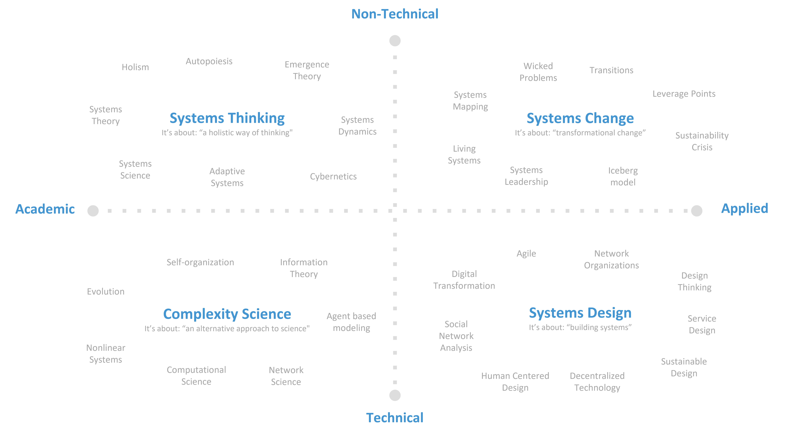

---

# Systems Thinking - The Timeline

Source: [Systems Innovation Guide](https://www.systemsinnovation.io/post/systems-innovation-guide)
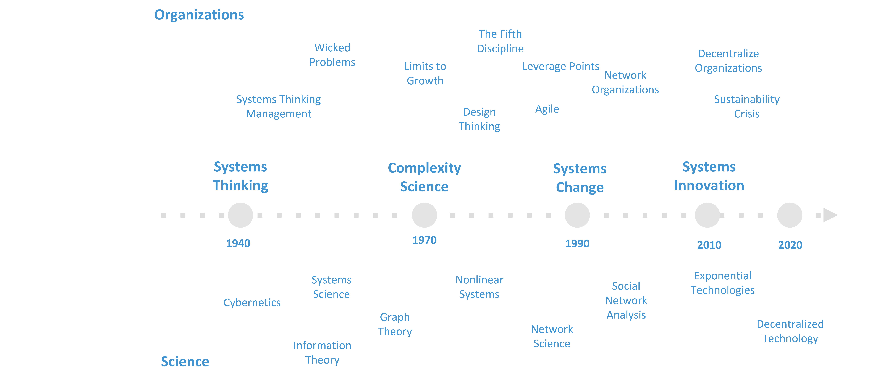

---

# Tools - 6 Fundamental Concepts of Systems Thinking

See: [Details](https://github.com/thomykay/devspace-systemsthinking/blob/main/src/material/tools-of-a-systems-thinker.md)

---

# The Fifth Disciplin - The Book

Peter Senge, 1990

Idea of "The Learning Organization"

---

# The Five Diciplines

See: [Details](https://github.com/thomykay/devspace-systemsthinking/blob/main/src/material/the-fifth-discipline.md)

---

# The Seven Learning Disabilities

1. I am my position.
2. “The enemy Is out there” syndrome.
3. The illusion of taking charge.
4. Fixation on events. 
5. The Parable of the Boiled Frog.
6. The delusion of learning from experience.
7. The myth of the management team.

See: [Details](https://github.com/thomykay/devspace-systemsthinking/blob/main/src/material/the-fifth-discipline.md)

---

# 11 Laws of Systems Thinking

See: [Details](https://github.com/thomykay/devspace-systemsthinking/blob/main/src/material/the-fifth-discipline.md)

---
<!-- backgroundColor: lightblue -->

# Exercise - The Fifth Discipline
|Time|What|Comments|
|--|--|--|
|🕜4min|In your group, bring an example each...||

---
<!-- backgroundColor: default -->
# Current Reality Tree

...is a tool to **analyze** many systems or organizational problems at once. By **identifying root causes** common to most or all of the problems, a CRT can greatly aid focused improvement of the system. A current reality tree is a **directed graph**.

---

# Current Reality Tree (CRT) - Structure

---

# Undesirable Effects (UDE)

“An UDE is essentially the first indication you have that something might be amiss in the system. It is something that really exists and is negative on its own merits.” – William Dettmer, The Logical Thinking Processes, 2007

* Examples
  * Employee morale is low
  * Decreasing profit
  * Attrition is increasing
  * byo…

---
<!-- backgroundColor: lightblue -->
# UDE Excercise - Team from Hell

Source: [Solving Problems with Theory of Constraints, CRTs @ Lean Agile Edinburgh](https://www.slideshare.net/lazallen/solving-problems-with-theory-of-constraints-current-reality-trees-lean-agile-edinburgh)

|Time|What|How|
|--|--|--|
|🕜3min|Individually: Note **7 things that drive you crazy** about team work
|🕜10min|Share the lists with each other.|*Bingo*...|
|🕜6min|As a 'new team', what are your top 5?|
|🕜10min|Share horror stories about each person's experience with Teams From Hell.||

---
<!-- backgroundColor: default -->
# UDE Debrief - Team Dysfunctions

---

# What is a Mental Model?

A mental model is an **explanation of how something works**. The phrase “mental model” is an overarching term for any sort of concept, framework, or worldview that you carry around in your mind.

Mental models help you **understand life**.

Source: [Mental Models: Learn How to Think Better and Gain a Mental Edge](https://jamesclear.com/mental-models)

---

# 5 Mental Models

---
<!-- backgroundColor: lightblue -->
# Exercise - 5 Mental Models

---
<!-- backgroundColor: default -->
# Reading a CRT (1)

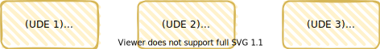

---

# Reading a CRT (2)

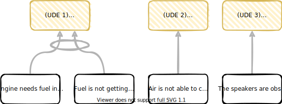

---

# Reading a CRT (3)

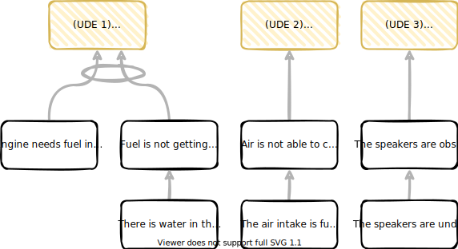

---

# Reading a CRT (4)

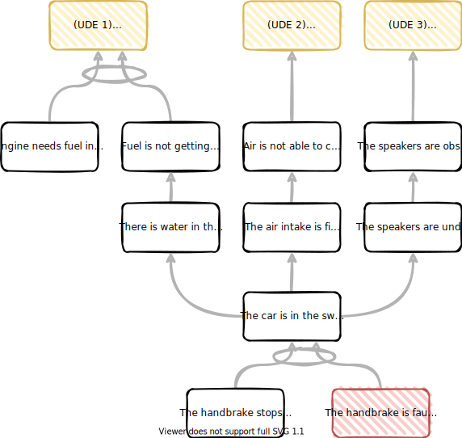

---
<!-- backgroundColor: lightblue -->
# CRT Exercise - Team from Hell

Starting with the collected UDEs, build the CRT for the “Team from Hell”.

|Time|What|How|
|--|--|--|
|🕜10min|Identify intermediate effects and how they are related||
|🕜...| Can you identify any root causes? Which?|
|🕜5min|As a group, prepare to read through your CRT|

---

# CRT - Reading (Extra)

Source: [Scrutinizing and improving a Logical Current Reality Tree](https://www.youtube.com/watch?v=NVrEt6hDJVM&t=65s)

Unoptimized             |  Optimized
:-------------------------:|:-------------------------:
  |  

---
<!-- backgroundColor: default -->
# Future Reality Tree (FRT)

---

# Injection

* An injection is a new condition or action that does not exist in the current reality. It is something **you must make happen** in order for the future reality to unfold the way you want it to

---

# Negative Branches

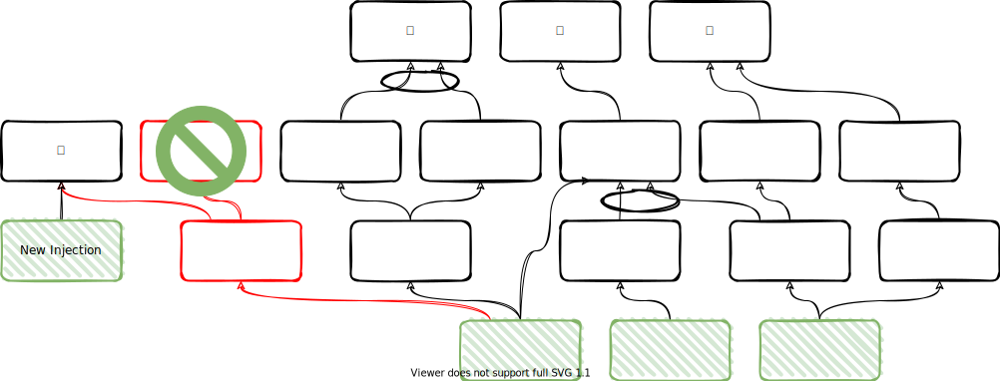

---
<!-- backgroundColor: lightblue -->
# FRT Exercise - Team from Hell

How can we escape the hell with our team - into a bright future 🌞?

|Time|What|
|--|--|
|🕜7min|What would the **desirable effects** be in the FRT?||
|🕜7min|Can you think about any possible **injections** to address the root causes?
|🕜...|Optional: Think about one of your injections and write down a possible **negative branch** for that injection (no need to trim it). 

---
<!-- backgroundColor: default -->
# Causal Loop Diagrams (CLD)

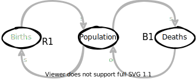
aid in visualizing how different variables in a system are causally interrelated. The diagram consists of a set of words and arrows. Causal loop diagrams are accompanied by a narrative which describes the causally closed situation the CLD describes.

---

# Causal Loop Diagrams (CLD) - Structure

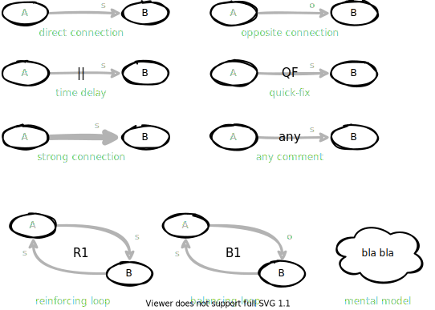

---

# CLD - Example Population

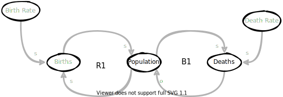

How can you read this CLD?

---

# CLD - Example Population (2)

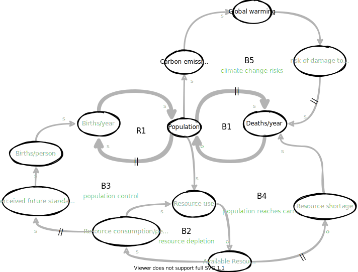

Source: [How Systems Create Their Own Behavior](https://systemsandus.com/2016/12/26/how-systems-create-their-own-behavior/)

---

# CLD - Building a CLD - Before you start

Source: [Systems Thinking mit Causal-Loop-Diagrammen](https://agilecoach.de/wissen/systems-thinking-mit-causal-loop-diagrammen/)

* What are the aspects and boundaries of the system in focus?
* What's the detail level we want to look at?

* ➡️ Don't try to build "the whole system" from the beginning
* Which problem are we looking at with the model to be created?

> Example: "We observe again and again that we have to push a lot of short-cycle hotfixes after each release. This causes a lot of stress in the teams and our users are obviously not really satisfied either. Let's try to model these problems in a causal loop diagram."

---

# Building a CLD (1) - Identify System Variables

* What variables are there in our system that might have something to do with our problem?
* ➡️ Be precise in naming the variables, ideally make them quantitative

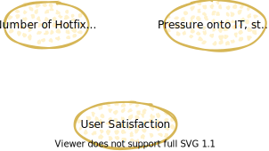

---

# Building a CLD (2) - Dynamics and changes of system variables

* What relationship can be established between individual system variables?
* Do two system variables influence each other directly or are other variables involved?
* Which other aspects play a role in the environment of an identified variable?

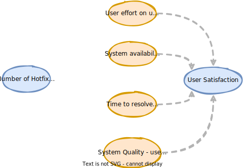

---

# Building a CLD (3) - Reinforcement and weakening of system variables

* If variable A changes upward, that is, becomes stronger, higher, or more in its expression, how does variable B change?

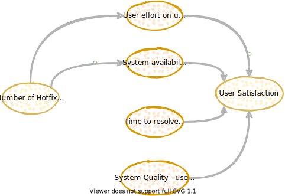

---

# Building a CLD (4) - Delayed influence of system variables

* Add additional influences, causes and identify delays in the process

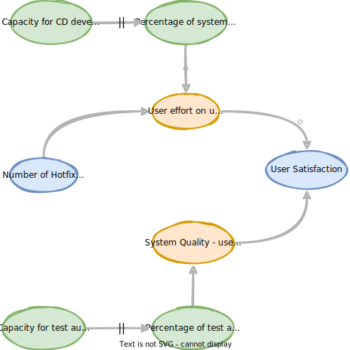

---
<!-- backgroundColor: lightblue -->
# CLD - Exercise

## Build an initial CLD from a problem/challenge you are facing within your team/project

|Time|What|How|
|--|--|--|
|🕜5m|🧠 Think for yourself||
|🕜15m|🧑🏻‍🤝‍🧑🏼 Work together to create the thing||
|🕜
---
# CLD - Exercise - Debrief

---
<!-- backgroundColor: default -->
# CLD - Debrief

Source: [Identifying the “right” interventions in the wicked complexity of the COVID-19 pandemic](https://realkm.com/2020/08/07/identifying-the-right-interventions-in-the-wicked-complexity-of-the-covid-19-pandemic/)

---

# What did we learn?
