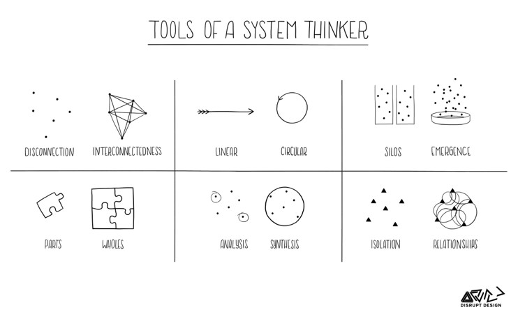
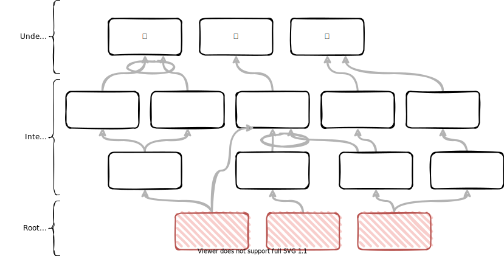
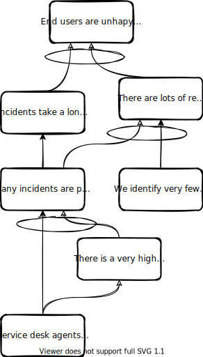
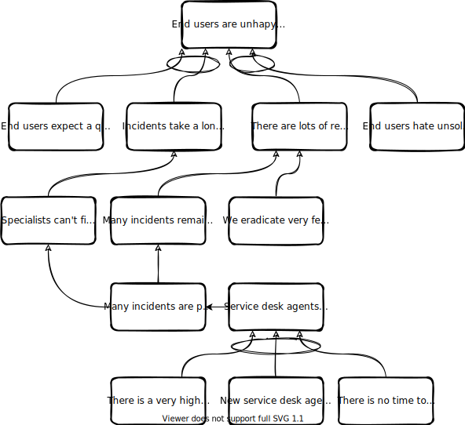
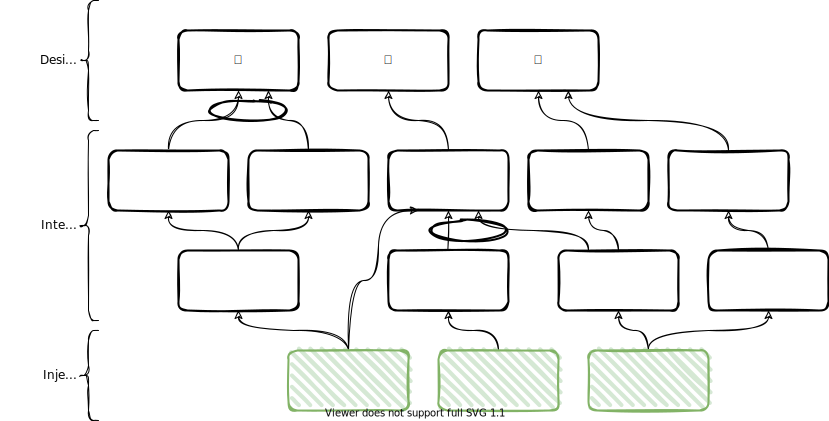

<!-- markdownlint-disable MD025 MD045 MD012 -->
# Systems Thinking - ganz praktisch

 I start writing here.

---

# What makes you complex?

Connect with others

---

# Why are you here?

Connect with the topic

---

# What is a System?

---

# What is Systems Thinking?

* is the ability or skill to perform problem solving in complex system
* Systems thinking is your ability to see things as a whole (or holistically) including the many different types of relationships between the many elements in a complex system.

---

# Tools - 6 Fundamental Concepts of Systems Thinking

---

# Current Reality Trees (CRT) - Structure

---

# Undesirable Effects (UDE)

“An UDE is essentially the first indication you have that something might be amiss in the system. It is something that really exists and is negative on its own merits.” – William Dettmer, The Logical Thinking Processes, 2007

* Examples
  * Employee morale is low
  * Decreasing profit
  * Attrition is increasing
  * byo…

---

# UDE Excercise - Team Dysfunctions

---

# UDE Excercise - Team from Hell

Source: [Solving Problems with Theory of Constraints Current Reality Trees @ Lean Agile Edinburgh](https://www.slideshare.net/lazallen/solving-problems-with-theory-of-constraints-current-reality-trees-lean-agile-edinburgh)

1. each person writes down a list
What are 7 things that drive you crazy about team work?
2. Share the lists, and rank as a new team, what are the top 5.
3. Share horror stories about each person's experience with Teams From Hell.

---

# CRT - Reading

Source: [Scrutinizing and improving a Logical Current Reality Tree](https://www.youtube.com/watch?v=NVrEt6hDJVM&t=65s)

Unoptimized             |  Optimized
:-------------------------:|:-------------------------:
  |  

---

# Future Reality Tree (FRT)

---

# Injection

* An injection is a new condition or action that does not exist in the current reality. It is something **you must make happen** in order for the future reality to unfold the way you want it to
