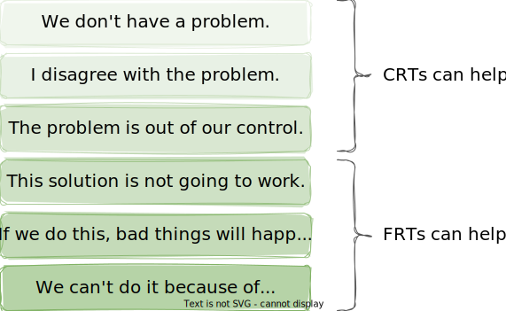
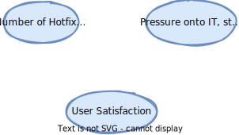
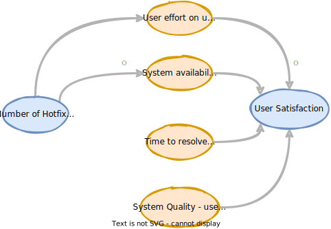

<!-- markdownlint-disable MD025 MD045 MD012 MD024 MD033 -->

# Systems Thinking - ganz praktisch

 Egal ob es um die Situation in Deinem **Team**, die **Firma** in der Du arbeitest, Deine persönliche Weiterentwicklung oder um große **globale Themen** geht: Sich „ein Bild“ von der Welt zu machen ist nicht einfach. Um komplexe Systeme und deren Wirkzusammenhänge zu verstehen, existieren eine Reihe **mentale Modelle** und zugehörigen Visualisierungstechniken.

Wir werden ausgewählte – z. B. Ladder of Inference, **Causal Loop Diagrams**, **Current Reality Trees und Future Reaility Trees** – kennenlernen und sie auf praktische Alltagssituationen anwenden. Nach dem Workshop werdet ihr „eure Systeme“ wieder ein bisschen gezielter beeinflussen und verbessern können.

---

<!-- _backgroundColor: lightblue -->

## Practice - ⏲️10min

* 
🤹 What makes you complex as a living system?

* 
🧑ğŸ»â€ğŸ¤â€ğŸ§‘🼠What kind of system is your team, your company?

---

<!-- _backgroundColor: lightblue -->

## Practice - ⏲️10min

* 
🕸️ How much do you work with Systems Thinking so far?

* 
👊 What are your motivation and questions for today's workshop?

---

## Some Logistics

* 3x90 minutes, with breaks, ➡️ 14:30
* This is a PowerPoint free session 🤪
* All material in English (Really?)
* [Our Miro board](https://miro.com/app/board/uXjVN4MP498=/?share_link_id=374257498501)
* [Our Github repo](https://github.com/thomykay/devspace-systemsthinking/tree/%23devspace2024)
* We are all experts. We are all learners.
* Let'make this a safe space for all of us!
  
---

## What is a System?

---

## What is Systems Thinking?

* is the ability or skill to perform problem solving in complex system
* Systems thinking is your ability to see things as a whole (or holistically) including the many different types of relationships between the many elements in a complex system.

> The same old thinking will create the same old results, thus we need to start by changing our way of thinking and looking at the world.

---

## Systems Thinking - The Domains

<!-- Source: [Systems Innovation Guide](https://www.systemsinnovation.io/post/systems-innovation-guide)-->

---

## Systems Thinking - The Timeline

<!-- _footer: Source: [Systems Innovation Guide](https://www.systemsinnovation.io/post/systems-innovation-guide) -->
---

## Tools - 6 Fundamental Concepts of Systems Thinking

See: [Details](https://github.com/thomykay/devspace-systemsthinking/blob/main/src/material/tools-of-a-systems-thinker.md)

---

## The Fifth Disciplin - The Book

Peter Senge, 1990

Idea of "The Learning Organization"

---

## The Five Diciplines

See: [Details](https://github.com/thomykay/devspace-systemsthinking/blob/main/src/material/the-fifth-discipline.md)

---

## Current Reality Tree (what to change from)

...is a tool to **analyze** many systems or organizational problems at once. By **identifying root causes** common to most or all of the problems, a CRT can greatly aid focused improvement of the system. A current reality tree is a **directed graph**.

---

## Current Reality Tree (CRT) - Structure

---

## Undesirable Effects (UDE)

> “An UDE is essentially the first indication you have that something might be amiss in the system. It is something that really exists and is negative on its own merits.”
> 
> William Dettmer, The Logical Thinking Processes, 2007

* Examples
  * Employee morale is low
  * Decreasing profit
  * Attrition is increasing
  * byo…

---

<!-- _backgroundColor: lightblue -->

## UDE Exercise - ⏲️15min

|Time|What|
|--|--|
|🕜3min|Individually: Note **5 things that drive you crazy** about team work|
|🕜7min|Share the lists with each other.|*Bingo*...|
|🕜5min|As a 'new team': What are **your top 3**?|
|🕜...|Optional: Share horror stories about each person's experience with Teams From Hell.|

<!-- _footer: Source: [Solving Problems with Theory of Constraints, CRTs @ Lean Agile Edinburgh](https://www.slideshare.net/lazallen/solving-problems-with-theory-of-constraints-current-reality-trees-lean-agile-edinburgh)
-->

---

<!-- _backgroundColor: lightblue -->

## UDE Debrief - ⏲️5min

* 🪢 What reminded you of your day-to-day experiences?
* 💬 What did this teach you about great communication?
* 🎯 How did you align on the goal?

---

<!-- backgroundColor: default -->
## Reading a CRT (1)

---

## Reading a CRT (2)

---

## Reading a CRT (3)

---

## Reading a CRT (4)

---

<!-- _backgroundColor: lightblue -->

## CRT Exercise - Team from Hell - ⏲️ 15min

Starting with the collected UDEs, build the CRT for the “Team from Hell”.

|Time|What|How|
|--|--|--|
|🕜10min|Identify **intermediate effects** and how they are related||
|...| Can you identify any **root causes**? Which?|
|🕜5min|As a group, prepare to read through your CRT|

---
<!-- _backgroundColor: lightblue -->

## CRT - Debrief

* 💬 Doing it again, how would you communicate differently?
* 👌 How did you organize yourselves as a team?
* 👀 What are you more aware of now?

---

<!-- _backgroundColor: lightpink -->

## CRT - Reading (Extra)

Unoptimized             |  Optimized
:-------------------------:|:-------------------------:
  |  

<!-- _footer: Source: [Scrutinizing and improving a Logical Current Reality Tree](https://www.youtube.com/watch?v=NVrEt6hDJVM)
-->

---

## Future Reality Tree (what to change to)

is a **visualization of a desired, improved future state**. ... A FRT usually follows an analysis with a Current Reality Tree and other visual analysis methods.

---
<!-- backgroundColor: default -->
## Future Reality Tree (FRT)

---

## Injection

* An injection is a new condition or action that does not exist in the current reality. It is something **you must make happen** in order for the future reality to unfold the way you want it to.

---

## Negative Branches

---

<!-- _backgroundColor: lightblue -->

## FRT Exercise - Team from Hell - ⏲️ 15min

How can we escape the hell with our team - into a bright future 🌞?

|Time|What|
|--|--|
|🕜 7min| What would the **desirable effects** be in the FRT?||
|🕜 7min| Can you think about any possible **injections** to address the root causes?|
|🕜...  | Optional: Think about one of your injections and write down a possible **negative branch** for that injection (no need to trim it).|

---

<!-- _backgroundColor: lightblue -->

## FRT - Debrief

* 👌 Did something unpredictable happen? What was unpreditable?
* 🎬 What did you learn about yourself and the team?
* 💚 What else would you like to share?

---
## One more thing...

---

<!-- _backgroundColor: lightgreen -->

## What we've covered

* Systems, Systems Thinking
* Current Reality Trees
  * Undesirable Effects
  * Root Causes
* Future Reality Trees
  * Desirable Effects
  * Injections
  * Negative Brances

---

## Break

# ☕🫖

---

## What is a Mental Model?

A mental model is an **explanation of how something works**. The phrase “mental model” is an overarching term for any sort of concept, framework, or worldview that you carry around in your mind.

Mental models help you **understand life**.

<!-- _footer: Source: [Mental Models: Learn How to Think Better and Gain a Mental Edge](https://jamesclear.com/mental-models)
-->

---

## 5 Mental Models

---

<!-- _backgroundColor: lightblue -->

## Practice - 5 Mental Models - ⏲️ 20min

You are the experts. Prepare a short 3min talk for the whole group, explain your model.

* What's the essence of the model?
* What are the core take aways of the model?
* What possible applications do you see to see or change your world?
  
|Time|What|
|--|--|
||Organize the team, how do you process the material?|
|🕜10min|Read the material, share what you understood|
|🕜10min|Shape the talk, test it

---

<!-- _backgroundColor: lightblue -->

## Debrief - Mental Models - ⏲️ 5min

* 💬 Doing it again, how would you communicate differently?
* 🪢 What ideas, innovation or changes emerged?
* 🎬 What are you more aware of now?

---

<!-- _backgroundColor:  LightGreen -->

## What we've covered

* Systems, Systems Thinking
* Current Reality Trees
* Future Reality Trees
* **Mental Models**

---

## Break

# 🍕🍝🍅☕🫖

---

## Causal Loop Diagrams (CLD)

aid in visualizing how different variables in a system are causally interrelated. The diagram consists of a set of words and arrows. Causal loop diagrams are accompanied by a narrative which describes the causally closed situation the CLD describes.

---

## CLD - Structure

---

## CLD - Example - Population

How can you read this CLD?

---

## CLD - Example - Population (2)

<!-- _footer: Source: [How Systems Create Their Own Behavior](https://systemsandus.com/2016/12/26/how-systems-create-their-own-behavior/)
-->

---

## CLD - Building a CLD - Before you start

* What are the aspects and boundaries of the system in focus?
* What's the detail level we want to look at?

* ➡️ Don't try to build "the whole system" from the beginning
* Which problem are we looking at with the model to be created?

> Example: "We observe again and again that we have to push a lot of short-cycle hotfixes after each release. This causes a lot of stress in the teams and our users are obviously not really satisfied either. Let's try to model these problems in a causal loop diagram."

<!-- _footer: Source: [Systems Thinking mit Causal-Loop-Diagrammen](https://agilecoach.de/wissen/systems-thinking-mit-causal-loop-diagrammen/)
-->

---

## Building a CLD (1) - Identify System Variables

* What variables are there in our system that might have something to do with our problem?
* ➡️ Be precise in naming the variables, ideally make them quantitative

---

## Building a CLD (2) - Dynamics and changes of system variables

* What relation can be established between individual system variables?
* Do two system variables influence each other directly or are other variables involved?
* Which other aspects play a role in the environment of an identified variable?

---

## Building a CLD (3) - Reinforcement and weakening of system variables

* If variable A changes upward, that is, becomes stronger, higher, or more in its expression, how does variable B change?

---

## Building a CLD (4) - Delayed influence of system variables

* Add additional influences, causes and identify delays in the process

---

<!-- _backgroundColor: lightblue -->

# CLD - Exercise - ⏲️ 25min

Build an initial CLD from a problem/challenge you are facing within your team/context.

|Time|What|
|--|--|
|🕜5min|Explain your scenario. The team makes notes (Identify System Variables)|
|🕜15min|🧑🏻‍🤝‍🧑🏼Find relations and more aspects, consider reinforcement and weakening relations|
|🕜10min|🧑🏻‍🤝‍🧑🏼Can you find delays, identify loops in the scenario?

---
<!-- _backgroundColor: lightblue -->

# CLD - Exercise - Debrief - ⏲️ 5min

* 🎬 What would an expert make of your experience?
* 👌 How was the participation distributed?
* 🎯 What was most challenging?

---

## One more thing...

<!-- _footer: Source: [Identifying the “right” interventions in the wicked complexity of the COVID-19 pandemic](https://realkm.com/2020/08/07/identifying-the-right-interventions-in-the-wicked-complexity-of-the-covid-19-pandemic/)
-->

---

## Addendum - CLD Archetypes

Source: [Tools for Systems Thinkers: The 12 Recurring Systems Archetypes](https://medium.com/disruptive-design/tools-for-systems-thinkers-the-12-recurring-systems-archetypes-2e2c8ae8fc99)

Archetypes are recurring patterns of behavior that give insights into the structures that drive systems. They offer a way of deciphering systems dynamics across a diversity of disciplines, scenarios, or contexts.

Think of these archetypes as the **storylines of systems in the world**. Just as you can identify the same formula for a romcom or a thriller in a Hollywood film, these archetypes help systems thinkers see behaviors and flows in more concrete terms.

---

## Archetypes - Example - Fixes that Fail

a “quick-fix” solution can have unintended consequences that exacerbate the problem. It hypothesizes that the problem symptom will diminish for a short while and then return to its previous level, or become even worse over time.

For more, [see here](../material/system%20archetypes.md).

---

## Archetypes

* Drifting Goals
* Escalation
* Fixes That Fail
* Growth and Underinvestment
* Limits to Success
* Shifting the Burden
* Successful to the Successful
* Tradegy of the Commons

See [Details](../material/system%20archetypes.md)
See also [Systems Archetype Basics - From Story to Structure](https://thesystemsthinker.com/wp-content/uploads/2016/03/Systems-Archetypes-Basics-WB002E.pdf)

---

## One more thing.. about System Archetypes

* Archetypes are **"repeating stories"** in our systems
* These archetypes can be **visualized, understood and detected** by using CLDs
* They can help us to connect our practices, the patterns (and antipatterns we know) and the underlying fundamental principles how systems work
* Hence they can help us to act as a starting point for an **invitation for change**.

---
<!-- _backgroundColor: lightgreen -->

## What we've covered

* Systems, Systems Thinking
* Current Reality Trees
* Future Reality Trees
* Mental Models
* **Causal Loop Diagrams**
* **CLD Archetypes**

---

<!-- backgroundColor: lightblue -->

## Checkout

* 
🗯️ What has been my highest high and lowest low from this session?

* 
🤩 What's my biggest insight from today?

---

<!-- backgroundColor: default -->

## 🙏Thank you🙏

* 🕸️ [linkedin.com/in/thomaskrause](https://www.linkedin.com/in/thomaskrause/)
* 🗓️ [Let's talk!](https://calendly.com/talk-to-thkrause)
